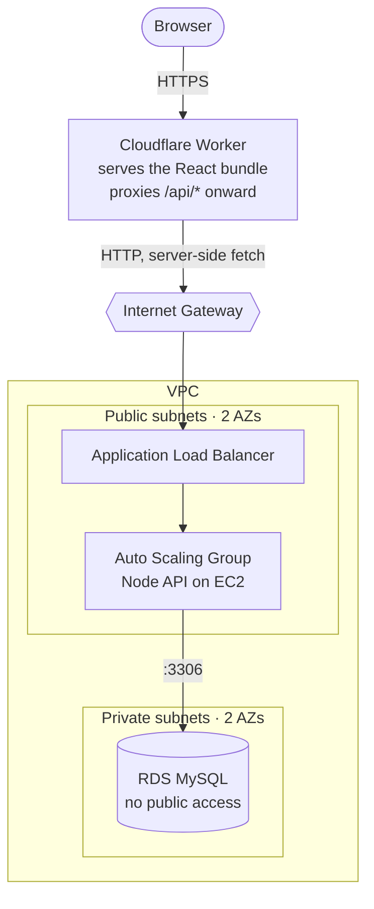
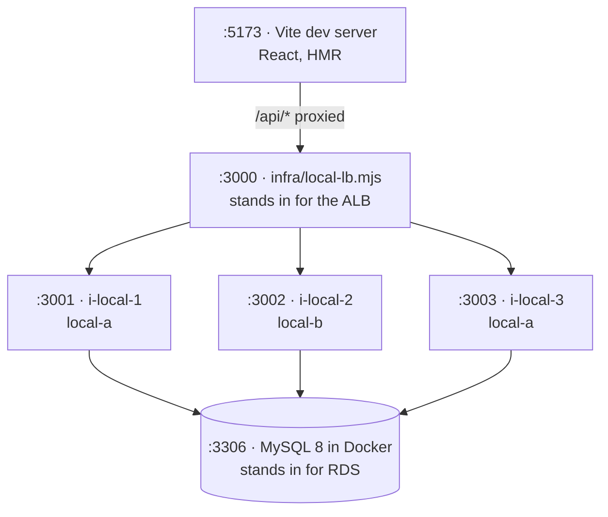

# Campus Wall

A reference implementation of a **hybrid deployment architecture** — and a working example
of how to make cloud infrastructure observable.

The frontend runs on **Cloudflare Workers** at the edge. The API runs on **EC2** behind an
Application Load Balancer and an Auto Scaling Group. The database is **MySQL on RDS** in a
private subnet.

Every API response is stamped with the **instance id and availability zone** that served it,
and the UI renders that stamp. Load balancing, autoscaling, health checks and instance
failure stop being abstractions you read about and become things you watch happen.



## ⚠️ Not production-ready — deliberately

This repository exists to make infrastructure behaviour *visible*, and several things are
simplified to keep it that way:

- **`/api/stress` is an unauthenticated endpoint that burns CPU on request.** It is gated
  behind `STRESS_ENABLED`, which you should leave off outside a demo.
- The application tier runs in **public subnets** with no NAT gateway.
- The database password is passed to instances through **EC2 user data**, not Secrets
  Manager or SSM Parameter Store.
- RDS is single-AZ, with backups disabled.

Every one of these is listed with its production counterpart in
[docs/ARCHITECTURE.md](docs/ARCHITECTURE.md#deliberate-limitations). Read that section
before borrowing anything here for real work, and **tear the stack down when you are
finished** — see [docs/AWS_SETUP.md](docs/AWS_SETUP.md#teardown).

## Quick start

```bash
pnpm install
pnpm dev
```

- **Client view** — http://localhost:5173
- **Display view** — http://localhost:5173/wall

Requires Node 22+, pnpm 9+, and Docker (for MySQL only).

> Run `pnpm install` once and commit `pnpm-lock.yaml`. CI and the EC2 bootstrap both use
> `--frozen-lockfile` and will fail without it.

## What `pnpm dev` starts



`infra/local-lb.mjs` is an Application Load Balancer in about 30 lines. It round-robins
**per request** like the real thing and health-checks targets every 10s, so you can exercise
failover, draining and request distribution locally with no AWS account.

**Ctrl-C one API process** and watch the badge disappear from the display view and the
activity meter redistribute.

| Command | What it does |
|---|---|
| `pnpm dev` | Full local fleet — use for anything load-balancer-shaped |
| `pnpm dev:solo` | One API on `:3000`, less terminal noise |
| `pnpm dev:edge` | `wrangler dev` — the real Worker. **Run before every deploy.** |
| `pnpm db:up` / `pnpm db:down` | MySQL container |
| `pnpm build` / `pnpm typecheck` | Same as CI |

## The app

A reaction board. Each browser is handed a display name — *"You are ChunkChimp"* — and
eleven buttons: five canned messages, five emojis, and one optional load generator. Every
post appears on the display view tagged with that name and the instance that handled it.

There is **no free-text input anywhere**, and names cannot be chosen either. That is a
deliberate security property, not a missing feature: the database stores an enum, a small
integer and a name index — never user-supplied text.

Names are **unique**. Uniqueness is delegated to `AUTO_INCREMENT` on `sessions.seq`, so
several instances can hand out names concurrently without coordinating: the name is a pure
function of the sequence number. Hashing the session id into the list would be simpler, but
with 100 names and ~30 concurrent users a collision is about 99% likely. Past 100 sessions
the pool wraps — `Nebula 2`, `Nebula 3`.

| Method | Path | Notes |
|---|---|---|
| `GET` | `/health` | ALB health check. **Queries the DB.** |
| `GET` | `/api/posts` | Latest 50 posts + server stamp |
| `POST` | `/api/posts` | `{ kind, idx, session }` |
| `POST` | `/api/me` | `{ session }` → claims this browser's display name |
| `GET` | `/api/whoami` | Stamp only, no DB — for observing round-robin |
| `GET` | `/api/config` | `{ stressEnabled, burnMs }` — `burnMs` is the direct-call default |
| `POST` | `/api/stress` | Burns CPU. **403 when `STRESS_ENABLED` is off.** |

See which instance answers, twenty times in a row:

```bash
for i in $(seq 1 20); do curl -s localhost:3000/api/whoami | jq -r .served_by; done
```

## Five ideas worth taking away

1. **UI is not security.** The buttons constrain the UI; the server's allowlist is what
   enforces the contract. Anyone can call the load balancer directly.
2. **Blocking the event loop breaks your infrastructure.** Node is single-threaded — a
   blocking CPU loop stops `/health` responding, so the ALB marks the instance unhealthy and
   the ASG terminates a server that was working fine. See `apps/api/src/burn.ts`.
3. **Health checks are a contract.** `/health` queries the database, because an instance
   that cannot reach the database is not healthy.
4. **Push uniqueness down to the database.** Several instances assign display names at the
   same time and share no memory. `AUTO_INCREMENT` solves that atomically with no locking,
   no retry loop and no duplicate-key handling. See `apps/api/src/names.ts`.
5. **Stateless and stateful scale differently.** The edge tier scales to zero and to millions
   because it holds nothing. The database cannot, because it must hold everything. That
   distinction — not "frontend vs backend" — is what decides where code runs.

## Deployment

**Push to `main`.** That is the entire process: no `wrangler`, `aws`, `ssh` or `scp` from a
laptop. GitHub Actions runs CI, then deploys only the half that changed
(`packages/shared/**` counts as both).

| | Worker | EC2 fleet |
|---|---|---|
| Mechanism | `wrangler deploy` | SSM Run Command, targeted by ASG tag |
| Time | ~30s | ~90s |
| Auth | Stored API token | **OIDC — no stored credentials** |

## Documentation

| Doc | Contents |
|---|---|
| [`docs/ARCHITECTURE.md`](docs/ARCHITECTURE.md) | The design and every decision behind it |
| [`docs/LOCAL_DEVELOPMENT.md`](docs/LOCAL_DEVELOPMENT.md) | Running and testing locally |
| [`docs/AWS_SETUP.md`](docs/AWS_SETUP.md) | Building the infrastructure, step by step |
| [`docs/DEPLOYMENT.md`](docs/DEPLOYMENT.md) | CI/CD, OIDC, SSM, rollback |

## Cost

Roughly **$0.06/hour** to run: ALB ~$0.0225/hr, two t3.micro ~$0.0104/hr each, RDS
db.t4g.micro ~$0.016/hr, Cloudflare Workers free tier. No NAT Gateway and no S3 bucket, both
deliberately avoided.

Left running continuously that is **~$45/month**, dominated by the ALB and RDS.
**Tear the stack down when you are finished** — see `docs/AWS_SETUP.md`.

## License

MIT
