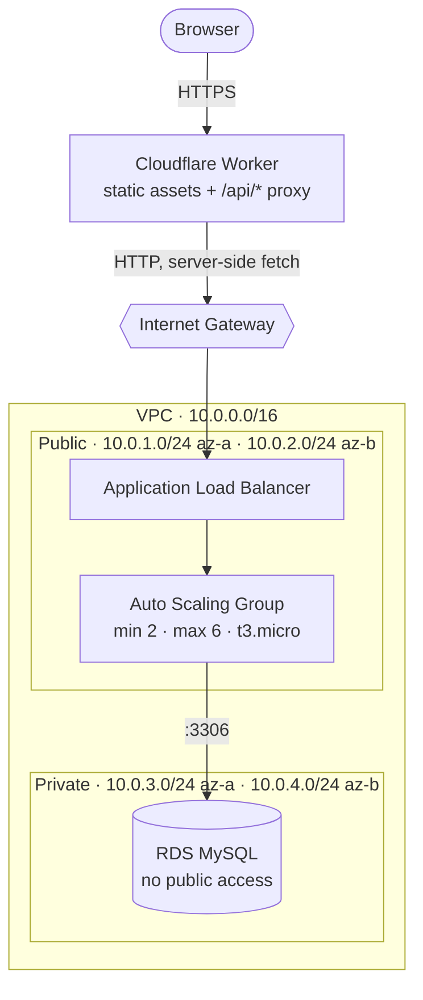
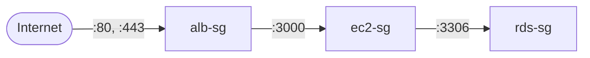

# Architecture

Why this system is shaped the way it is. Every decision here has an alternative that would
also work; what follows is the reasoning, including the trade-offs accepted.

## The shape



## Why split across two providers at all

The dividing line is **stateless vs stateful**, not "frontend vs backend".

The Worker holds nothing between requests, so it can scale to zero and to millions, run in
hundreds of locations, and cold-start in single-digit milliseconds. The API holds a
connection pool to a relational database, so it cannot. It needs a long-lived process, a
persistent TCP connection, and a network boundary it can sit inside.

Put each half where its constraints are cheapest. That is the whole argument.

| | Cloudflare Workers | EC2 + ALB + ASG |
|---|---|---|
| Good at | Static assets, global reach, bursty traffic, zero idle cost | Persistent connections, long-running work, anything stateful |
| Bad at | Holding a DB connection pool, long CPU work | Idle cost, cold capacity, global latency |

## Why the Worker proxies instead of the browser calling the ALB

A page served over HTTPS **cannot** `fetch()` an `http://` ALB — browsers block mixed
content. Three ways out:

| Option | Cost |
|---|---|
| Custom domain + ACM certificate on the ALB | Requires a domain, DNS, and certificate validation |
| Cloudflare DNS proxying to the ALB | Requires a domain |
| **Worker fetches the ALB server-side** | **Nothing** |

We take the third. The browser only ever talks to the Worker over HTTPS; the Worker's own
`fetch()` reaches the raw ALB hostname over HTTP. No domain, no certificate, no CORS
preflight, no DNS propagation.

It is also a real production pattern — **the edge as an API gateway**. Rate limiting, auth
and response caching belong there, where they cost nothing, rather than on an instance
billed by the hour.

**Trade-off:** all origin traffic appears to come from Cloudflare IPs, so the ALB cannot see
real client addresses. For per-client logic you would forward `CF-Connecting-IP` and trust
it only from known Cloudflare ranges.

## Why the app tier is in public subnets

This is the most debatable decision in the repository, and it is deliberate.

The textbook layout puts the application tier in private subnets behind a NAT Gateway.
That is correct for production. Here the app tier sits in **public** subnets with the
database private, because:

- **No NAT Gateway.** It is one of the more expensive small AWS resources (~$32/month plus
  data processing) and adds several minutes to provisioning.
- **The Internet Gateway becomes observable.** With instances in public subnets the IGW is
  directly in the request path, so removing the `0.0.0.0/0 → igw` route breaks the system in
  a way you can see and then repair.
- **Private subnets are still demonstrated**, by RDS. Connecting to the database from inside
  an instance works; connecting from anywhere else does not.

**In production, move the app tier to private subnets and add a NAT Gateway.** The security
groups below do most of the real work either way, but defence in depth matters.

## Security groups as a chain

Each group's inbound rule references **the security group before it**, never a CIDR block.



| Group | Port | Source |
|---|---|---|
| `alb-sg` | 80, 443 | `0.0.0.0/0` |
| `ec2-sg` | 3000 | `alb-sg` |
| `rds-sg` | 3306 | `ec2-sg` |

There is **no port 22 anywhere**. Shell access is via SSM Session Manager, which works
outbound-only and needs no inbound rule, no key pair and no bastion.

Referencing groups rather than CIDRs means the rules keep working as instances are replaced
and IPs change — which, under an Auto Scaling Group, is constantly.

## Why MySQL on RDS, and no S3

RDS in a private subnet demonstrates the network boundary concretely: the same
`mysql -h <endpoint>` command succeeds from an instance and hangs from anywhere else.

`db.t4g.micro` is the smallest sensible class and more than sufficient — the workload is a
handful of small inserts and one indexed 50-row select. It is covered by whichever free
allowance your account has, but note that AWS replaced the 12-month Free Tier on **15 July
2025**: accounts created after that date get a 6-month free plan plus credits instead.

Use **MySQL 8.4**. Version 8.0 left RDS standard support on 31 July 2026 and is now billed
under RDS Extended Support.

**No S3 bucket is used anywhere.** This is a constraint the repository keeps deliberately, to
show that a complete, deployable architecture does not require object storage. The main
consequence: **ALB access logs are unavailable**, since they can only be written to S3. Use
CloudWatch metrics instead.

## Making infrastructure observable

The core design decision of the application: **every response is stamped with its origin.**

```json
{ "served_by": "i-0a3f2b9c1d4e5f6a7", "az": "ap-south-1b", "uptime_s": 412 }
```

Four consequences:

| Behaviour | How it becomes visible |
|---|---|
| Load balancing | The badge changes as requests land on different instances |
| Autoscaling | New colours appear in the activity meter as the ASG grows |
| Health checks | A terminated instance's bar disappears, then a replacement appears |
| Internet Gateway | Remove the default route and everything stops |

The **activity meter** (`apps/web/src/client/useFleet.ts`) tracks which instances answered in
the last 10 seconds and how often. Without it, scaling out is a number changing in a console;
with it, you watch traffic redistribute.

### Polling, not WebSockets

The client polls every 2 seconds. This looks primitive and is intentional: a WebSocket is a
sticky connection that pins each client to one instance for its lifetime, which would hide
load balancing completely.

An ALB is a layer-7 proxy and routes **every request independently**, even over one
keep-alive connection — so polling genuinely distributes. **Target group stickiness must stay
off** or this stops working.

## The security model

**Nothing the client sends is stored as text.**

- `kind` is an enum (`preset` | `emoji`), `idx` is an integer `0..4`
- The database holds an enum and a small integer; the text lives in
  `packages/shared/src/content.ts`
- Display names are **assigned, and unique**: the browser keeps a random UUID in
  `localStorage`, and the server maps it to one of 100 fixed names. Users cannot choose
  their own name, so there is no second free-text field to sanitise

The eleven buttons are a UI affordance, not a security boundary — anyone can call the ALB
directly with `curl`. `apps/api/src/validate.ts` is what actually enforces the contract.

This also means **no moderation is required**, because there is no user-authored content.

### Unique names, without a locking protocol

Names must be distinct across the whole fleet, and several instances hand them out
concurrently without shared memory. Three options:

| Approach | Outcome |
|---|---|
| Hash the session id into the list | Simple, but with 100 names and ~30 people a collision is **~99% likely** (birthday paradox) |
| Claim rows with retries on duplicate-key | Correct, but needs probe loops and duplicate-key handling |
| **`AUTO_INCREMENT`** | The database allocates a distinct `seq` atomically; the name is a pure function of it |

The third needs no locking, no retries and no error-code inspection:

```ts
const n = seq - 1;
const name  = NAMES[(n * 37) % NAMES.length];   // 37 is coprime with 100 …
const round = Math.floor(n / NAMES.length);     // … so it permutes without repeating
return round === 0 ? name : `${name} ${round + 1}`;
```

`INSERT IGNORE` makes a repeat call for the same session a no-op rather than an error, so
there is no exception path to get wrong. Past 100 sessions the list wraps to `Nebula 2`.
Each instance caches the result in memory; the database stays the source of truth.

## The event loop is part of your infrastructure

`/api/stress` burns CPU on purpose, to exercise autoscaling. The naive implementation is a
bug with infrastructure-level consequences:

```js
while (Date.now() < end) { hash(); }   // WRONG
```

Node is single-threaded. That loop blocks the event loop, so `/health` stops responding, the
ALB marks the target unhealthy, and the ASG **terminates an instance that was working
perfectly**. Under sustained load this becomes an endless replacement cycle.

The fix is to yield between slices (`apps/api/src/burn.ts`):

```ts
const slice = Math.min(Date.now() + 5, end);
while (Date.now() < slice) { hash(); }
await new Promise((resolve) => setImmediate(resolve));
```

CPU still pegs; health checks still answer.

How long each press burns is **edge configuration** (`BURN_MS` in `wrangler.toml`), not
instance configuration. The Worker appends it as `?ms=` when proxying, and the API clamps
the result to 0–2000ms. Tuning it is a commit and ~40 seconds, rather than a new launch
template and an instance replacement — the same argument as `SHOW_STRESS`, and a small
illustration of why config belongs at the edge when the edge is what you can redeploy
cheaply. This is a real production failure mode, and it
is the clearest example in the repository of runtime behaviour and infrastructure behaviour
being the same subject.

Supporting settings: health check **timeout 5s** and **unhealthy threshold 5**, so a single
slow response under load cannot evict an instance.

## Failure behaviour

| Failure | What happens |
|---|---|
| One instance dies | ALB drains it, ASG launches a replacement, no downtime |
| Database unreachable | `/health` returns 503 `degraded`; ALB stops routing; the process **does not exit** |
| Database unreachable at boot | API listens anyway and retries the schema with backoff |
| All instances unhealthy | ALB returns 503; the Worker surfaces a clear error |
| Worker cannot reach the ALB | Returns 502 with the configured `ALB_HOST`, not a blank page |

The third row matters more than it looks: an instance can boot before RDS finishes
provisioning. Exiting would put systemd into a restart loop; starting degraded lets the ALB
make the decision, which is where that decision belongs.

## Deliberate limitations

Things this repository does **not** do, and what the production answer would be:

| Limitation | Production answer |
|---|---|
| Database credentials baked into user-data | SSM Parameter Store or Secrets Manager |
| App tier in public subnets | Private subnets + NAT Gateway |
| Instances pull source and build at boot | Golden AMI built in CI + instance refresh |
| Single-AZ RDS, no read replica | Multi-AZ deployment |
| No ALB access logs | Requires an S3 bucket |
| `/api/stress` is an unauthenticated CPU-burn endpoint | Never ship this |
| No rate limiting beyond a 1s client cooldown | Cloudflare Durable Object or KV at the edge |

The last two are why `STRESS_ENABLED` exists and defaults to off in any serious deployment.
