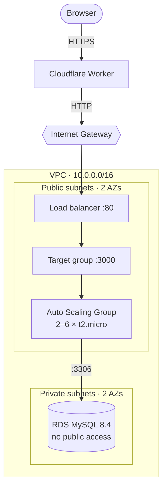

# AWS setup

Zero to deployed, in order. About **40 minutes** of console work, done **once**. After that,
every push to `main` deploys: see [DEPLOYMENT.md](DEPLOYMENT.md).

- **Region:** `ap-south-1` for everything. If you use another, change `AWS_REGION` in
  `.github/workflows/deploy.yml`.
- **Names:** use the names shown in **bold** exactly. The workflow and later steps refer
  to them.
- **Why it's built this way:** [ARCHITECTURE.md](ARCHITECTURE.md). **What the IAM pieces
  are:** [IAM_AND_OIDC.md](IAM_AND_OIDC.md).

## What you will build



## Values to keep at hand

You will copy these during setup. Keep them in a scratch note, **never in the repo**.

| Value | From step | Used in |
|---|---|---|
| Cloudflare API token + Account ID | 2 | 6 |
| Subject claim prefix | 5 | 5 |
| Deploy role ARN | 5 | 6 |
| RDS master password | 10 | 13 |
| RDS endpoint | 10 | 13 |
| Load balancer DNS name | 12 | 16 |

---

## Part 1 — Before AWS

### Step 1. Publish the repository

Instances clone the repository at boot without credentials, so it must be **public**.

1. Push the repository to GitHub, including `pnpm-lock.yaml`.
2. **Settings → General → Danger Zone → Change visibility → Public.**
3. In `infra/user-data.sh`, replace **both** placeholders in the `REPO=` line with your
   GitHub username and your repository's name, then commit and push:

   ```bash
   REPO="https://github.com/<OWNER>/<REPO>"
   # e.g.
   REPO="https://github.com/your-username/hybrid-deploy-arch-demo"
   ```

> ⚠️ `REPO=` is the only line of that file you commit. `<RDS_ENDPOINT>` and
> `<RDS_PASSWORD>` are filled in later, in the console (step 13).

### Step 2. Cloudflare token

1. **dash.cloudflare.com → Manage Account → Account API Tokens → Create Token.**
2. Template **Edit Cloudflare Workers** → Create. Copy the token (shown once).
3. Copy your **Account ID** from the dashboard home sidebar.

---

## Part 2 — IAM

### Step 3. EC2 instance role

**IAM → Roles → Create role → AWS service → EC2.**

| Field | Value |
|---|---|
| Permissions | **`AmazonSSMManagedInstanceCore`** |
| Name | **`campuswall-ec2-role`** |

### Step 4. GitHub OIDC provider

**IAM → Identity providers → Add provider → OpenID Connect.**

| Field | Value |
|---|---|
| Provider URL | `https://token.actions.githubusercontent.com` |
| Audience | `sts.amazonaws.com` |

### Step 5. Deploy role

**a. Copy your subject claim prefix.** On GitHub: **Repo → Settings → Actions → OIDC.**
Copy *Default subject claim prefix* with the copy button. It looks like
`repo:OWNER@123/hybrid-deploy-arch-demo@456`. Leave **Use default template** ticked.

**b. Create the role.** **IAM → Roles → Create role → Custom trust policy.** Paste this,
replacing `<ACCOUNT_ID>` and `<SUBJECT_PREFIX>`:

```json
{
  "Version": "2012-10-17",
  "Statement": [{
    "Effect": "Allow",
    "Principal": { "Federated": "arn:aws:iam::<ACCOUNT_ID>:oidc-provider/token.actions.githubusercontent.com" },
    "Action": "sts:AssumeRoleWithWebIdentity",
    "Condition": {
      "StringEquals": {
        "token.actions.githubusercontent.com:aud": "sts.amazonaws.com",
        "token.actions.githubusercontent.com:sub": "<SUBJECT_PREFIX>:ref:refs/heads/main"
      }
    }
  }]
}
```

> ⚠️ Paste the prefix exactly, keep `:ref:refs/heads/main` after it, and use no wildcards.
> This line is what stops any other repository from deploying to your account.

**c. Add permissions.** On the *Add permissions* page choose **Create inline policy**, switch
the editor to **JSON**, and paste:

```json
{
  "Version": "2012-10-17",
  "Statement": [{
    "Effect": "Allow",
    "Action": ["ssm:SendCommand", "ssm:ListCommandInvocations", "ssm:GetCommandInvocation"],
    "Resource": "*"
  }]
}
```

**d. Name and create.** Role name **`campuswall-gha-deploy`** → **Create role**.

**e. Copy the role ARN.** **IAM → Roles →** search `campuswall-gha-deploy` → click the role
name. In the **Summary** box at the top, find **ARN** and click the copy icon next to it. It
looks like:

```
arn:aws:iam::123456789012:role/campuswall-gha-deploy
```

This is the value of the `AWS_DEPLOY_ROLE_ARN` secret in step 6.

### Step 6. GitHub secrets

**Repo → Settings → Secrets and variables → Actions → New repository secret.**

| Name | Value |
|---|---|
| `AWS_DEPLOY_ROLE_ARN` | Role ARN from step 5e |
| `CLOUDFLARE_API_TOKEN` | Token from step 2 |
| `CLOUDFLARE_ACCOUNT_ID` | Account ID from step 2 |

---

## Part 3 — Network

### Step 7. VPC

**VPC → Create VPC → VPC and more.**

| Field | Value |
|---|---|
| Name tag auto-generation | **`campuswall`** |
| IPv4 CIDR | `10.0.0.0/16` |
| IPv6 | None |
| Availability Zones | **2** |
| Public subnets | **2** |
| Private subnets | **2** |
| NAT gateways | **None** |
| VPC endpoints | None |
| DNS hostnames / DNS resolution | Both enabled |

Choose **Create VPC** and wait for every item on the progress page to turn green.

**Then turn on public IPs for the two public subnets.** The wizard leaves this off.

1. In the **VPC console's left sidebar**, open **Subnets**. You'll see the four subnets the
   wizard just created, named like `campuswall-subnet-public1-ap-south-1a`.
2. Tick the checkbox of **`campuswall-subnet-public1-…`** only.
3. **Actions → Edit subnet settings.**
4. Under *Auto-assign IP settings*, tick **Enable auto-assign public IPv4 address** →
   **Save**.
5. Repeat steps 2–4 for **`campuswall-subnet-public2-…`**.
6. Check: in the Subnets list, the **Auto-assign public IPv4 address** column reads **Yes**
   for both `public` subnets and **No** for both `private` ones.

> ⚠️ Without this, instances have no internet route (there is no NAT). They show as
> `Running`, but can't install the app and can't receive deploys.

### Step 8. Security groups

**EC2 → Security Groups → Create security group**, three times, in this order, all in
**`campuswall-vpc`**:

| Name | Inbound rule | Source |
|---|---|---|
| **`alb-sg`** | HTTP `80` | `0.0.0.0/0` |
| **`ec2-sg`** | Custom TCP `3000` | the **`alb-sg`** group |
| **`rds-sg`** | MySQL/Aurora `3306` | the **`ec2-sg`** group |

> ⚠️ All three are **inbound** rules. Leave outbound at the default. Do not add port 22.

---

## Part 4 — Database

RDS takes about 8 minutes to create. Start it, then continue with Part 5 while it builds.

### Step 9. DB subnet group

**RDS → Subnet groups → Create DB subnet group.**

| Field | Value |
|---|---|
| Name | **`campuswall-db-subnets`** |
| VPC | `campuswall-vpc` |
| Availability Zones | Both |
| Subnets | **The two private subnets only** |

### Step 10. Database

**RDS → Databases → Create database.** Fields not listed: leave the default.

| Section | Field | Value |
|---|---|---|
| Creation method | | **Full configuration** |
| Engine options | Engine type | **MySQL** (not *Aurora*, which is selected by default) |
| Templates | | **Free tier** if shown, otherwise **Dev/Test** |
| Availability | | **Single-AZ DB instance** (Free tier selects it for you) |
| Settings | Engine version | **MySQL 8.4.x** (newest offered; not 8.0) |
| | Enable RDS Extended Support | **Unchecked** |
| | DB instance identifier | **`campuswall-db`** |
| | Master username | **`admin`** |
| Credentials | Credentials management | **Self managed** (not *Secrets Manager*) |
| | Auto generate password | **Unchecked**. Type a password and save it |
| Instance configuration | Class | **Burstable → `db.t4g.micro`** |
| Storage | Type / size | **gp3**, **20** GiB |
| | Enable storage autoscaling | **Unchecked** |
| Connectivity | Compute resource | **Don't connect to an EC2 compute resource** |
| | VPC | **`campuswall-vpc`** (not *Default VPC*) |
| | DB subnet group | **`campuswall-db-subnets`** |
| | Public access | **No** |
| | VPC security group | **Choose existing → `rds-sg`**, remove `default` |
| Monitoring | Enable Enhanced Monitoring | **Unchecked** |
| | Log exports | All **unchecked** |
| Additional configuration | **Initial database name** | **`campuswall`** |
| | Enable automated backups | **Unchecked** |
| | Deletion protection | **Unchecked** |

> ⚠️ **Initial database name** is the most commonly missed field. Left blank, no database is
> created and the app never becomes healthy.
>
> ⚠️ If the smallest class offered is `db.t4g.medium`, or you see *DB cluster identifier*,
> you picked Aurora. Go back and choose **MySQL**.

Choose **Create database**. Once its status is **Available**, copy its **Endpoint**.

---

## Part 5 — Load balancer

### Step 11. Target group

**EC2 → Target Groups → Create target group → Instances.**

| Field | Value |
|---|---|
| Name | **`campuswall-tg`** |
| Protocol / port | HTTP **`3000`** |
| VPC | `campuswall-vpc` |
| Health check path | **`/health`** |

Expand **Advanced health check settings**. Three values differ from the console default:

| Field | Console default | Set to |
|---|---|---|
| Health check port | Traffic port | Traffic port (no change) |
| Healthy threshold | 5 | **2** |
| Unhealthy threshold | 2 | **5** |
| Timeout | 5 | 5 (no change) |
| Interval | 30 | **10** |
| Success codes | 200 | 200 (no change) |

On the next page (*Register targets*), add **nothing**. The Auto Scaling Group registers
instances itself. Choose **Create target group**.

After creating it: **Attributes → Edit → Deregistration delay `30`** seconds. Leave
**stickiness off**.

### Step 12. Load balancer

**EC2 → Load Balancers → Create → Application Load Balancer.**

| Field | Value |
|---|---|
| Name | **`campuswall-alb`** |
| Scheme | **Internet-facing** |
| VPC | `campuswall-vpc` |
| Mappings | Both AZs, the **public** subnet in each |
| Security group | **`alb-sg`** only (remove `default`) |
| Listener | **HTTP : 80 → forward to `campuswall-tg`** |

Copy its **DNS name**.

---

## Part 6 — Compute

### Step 13. Launch template

**EC2 → Launch Templates → Create launch template.**

| Field | Value |
|---|---|
| Name | **`campuswall-lt`** |
| AMI | **Amazon Linux 2023 kernel-6.18 AMI** |
| Instance type | **`t2.micro`** (free tier eligible) |
| Key pair | **Don't include in launch template** |
| Subnet | **Don't include in launch template** |
| Security group | **`ec2-sg`** |
| *Advanced:* IAM instance profile | **`campuswall-ec2-role`** |
| *Advanced:* Detailed CloudWatch monitoring | **Enable** |
| *Advanced:* Credit specification | **Unlimited** (otherwise CPU is capped at 10% once burst credits run out) |
| *Advanced:* Metadata version | **V2 only** |

**User data:** paste the whole of `infra/user-data.sh`, then replace two placeholders **in
the console box**:

```bash
DB_HOST=<RDS_ENDPOINT>     # endpoint from step 10, without :3306
DB_PASS=<RDS_PASSWORD>     # password from step 10
```

> ⚠️ Never commit these two values. The repository is public.

### Step 14. Auto Scaling Group

**EC2 → Auto Scaling Groups → Create Auto Scaling group.**

| Field | Value |
|---|---|
| Name | **`campuswall-asg`** |
| Launch template | `campuswall-lt` |
| VPC / subnets | `campuswall-vpc`, **both public** subnets |
| Load balancing | **Attach to an existing load balancer → `campuswall-tg`** |
| Health check type | **EC2** (leave ELB health checks off) |
| Health check grace period | `300` |
| Desired / Min / Max | **2 / 2 / 6** |
| Scaling policies | None (next step) |

Within ~3 minutes, **Target groups → `campuswall-tg` → Targets** shows two **healthy**
targets.

### Step 15. Scaling

**a. Alarm.** **CloudWatch → Alarms → Create alarm → Select metric → EC2 → By Auto
Scaling Group → `campuswall-asg` → `CPUUtilization`.**

| Field | Value |
|---|---|
| Statistic / period | Average / **1 minute** |
| Condition | Static, **Greater than `40`** |
| Datapoints to alarm | **1 of 1** |
| Notification | Remove it |
| Name | **`campuswall-cpu-high`** |

**b. Policy.** **EC2 → Auto Scaling Groups → `campuswall-asg` → Automatic scaling → Create
dynamic scaling policy.**

| Field | Value |
|---|---|
| Policy type | **Step scaling** |
| Name | **`campuswall-scale-out`** |
| CloudWatch alarm | `campuswall-cpu-high` |
| Action | **Add `2` capacity units** |
| Instance warmup | `60` seconds |

---

## Part 7 — Deploy and verify

### Step 16. Point the Worker at the load balancer

Edit `"vars"` in `apps/web/wrangler.jsonc`. Host name only: no `http://`, no trailing `/`.

```jsonc
"vars": {
  "ALB_HOST": "campuswall-alb-123456789.ap-south-1.elb.amazonaws.com",
  "SHOW_STRESS": "false",
  "BURN_MS": "2000"
}
```

Commit and **push to `main`**. In the **Actions** tab, `deploy-web` and `deploy-api` should
both go green. Nothing is run from your laptop.

### Step 17. Verify

```bash
curl -s http://<alb-dns>/health
# {"status":"ok","db":true,...}

for i in $(seq 1 10); do curl -s http://<alb-dns>/api/whoami; echo; done
# served_by alternates between two instance ids
```

Then open your `*.workers.dev` URL: `/` is the client view, `/wall` the display view.

### Step 18. Load generator (optional)

Set `"SHOW_STRESS": "true"` in `wrangler.jsonc` and push to show the **Stress the server**
button. Set it back to `"false"` when you're done; `/api/stress` is unauthenticated.

To generate load without the UI:

```bash
npx autocannon -c 20 -d 180 -m POST "http://<alb-dns>/api/stress?ms=500"
```

Scale-out takes 3–5 minutes: the alarm fires, two instances launch, boot and pass health
checks.

---

## Troubleshooting

**Shell into an instance:** EC2 → Instances → select → **Connect → Session Manager**. Logs:
`cat /var/log/user-data.log`, `journalctl -u campuswall -n 50`.

| Symptom | Fix |
|---|---|
| Instance shows `Public IPv4 address: –` or `Managed: false` | Step 7 auto-assign public IP is off. Fix it, then terminate the instances so the ASG replaces them |
| Targets stay `unhealthy` | Read `/var/log/user-data.log` on the instance. Usually the `REPO=` URL (wrong owner or repo name, or the repo isn't public), or no public IP |
| `/health` → `"db": false` after ~5 s | Network: `rds-sg` must have an **inbound** 3306 rule from `ec2-sg`, and RDS must use `rds-sg` |
| `/health` → `"db": false` immediately | Credentials: wrong `DB_HOST`/`DB_PASS` in user data, or **Initial database name** not `campuswall` |
| Database unreachable from instances, everything else fine | RDS was created in *Default VPC*. Delete and recreate it in `campuswall-vpc` |
| `Not authorized to perform sts:AssumeRoleWithWebIdentity` | The `sub` in step 5 doesn't match. Re-copy the prefix from Settings → Actions → OIDC. To see what GitHub sent: CloudTrail → Event history → `AssumeRoleWithWebIdentity` → `userIdentity.userName` |
| Deploy is green but nothing changed | ASG not named `campuswall-asg`, or the launch template has no instance profile |
| Worker returns `502` | `ALB_HOST` wrong (scheme, slash or typo), or `alb-sg` doesn't allow port 80 |
| Slows down after minutes of load | Credit specification isn't **Unlimited** |
| Only one instance ever answers | Target group stickiness is on |

---

## Teardown

Delete **everything**, in this order. Later items depend on earlier ones being gone.

**AWS**

1. **Auto Scaling Group** `campuswall-asg`: set desired and min to `0`, wait for the instances
   to terminate, then delete
2. **Load balancer** `campuswall-alb`
3. **Target group** `campuswall-tg`
4. **RDS database** `campuswall-db`: untick *final snapshot*, tick the acknowledgement
5. **DB subnet group** `campuswall-db-subnets`
6. **Launch template** `campuswall-lt`
7. **CloudWatch alarm** `campuswall-cpu-high`
8. **Security groups** `rds-sg`, `ec2-sg`, `alb-sg`
9. **VPC** `campuswall-vpc` (also removes its subnets, route tables and internet gateway)
10. **IAM roles** `campuswall-ec2-role`, `campuswall-gha-deploy`, and `rds-monitoring-role` if
    it exists
11. **IAM identity provider** `token.actions.githubusercontent.com`

**Cloudflare**

12. **Worker** `campuswall`: Workers & Pages → `campuswall` → Settings → Delete
13. **API token**: Manage Account → Account API Tokens → Roll or Delete

**GitHub**

14. **Repository secrets**: delete all three from step 6

### Verify nothing is left

Open **Amazon Q** in the AWS console (the Q icon in the top bar, region **Asia Pacific
(Mumbai)**) and paste:

```text
I am tearing down a demo stack in ap-south-1 and want to confirm NOTHING is left running or
billing. Audit only - do not delete anything. Report findings as a table with columns:
Resource type | Name/ID | Status (EXISTS / GONE) | Still billing?
Check every item below by name AND by scanning for orphans. If something exists, give me its
exact ID and the console path to delete it.

COMPUTE
1. EC2 instances in any state except "terminated" (tag aws:autoscaling:groupName = campuswall-asg, and any untagged)
2. Auto Scaling group: campuswall-asg
3. Launch template: campuswall-lt (and all of its versions)
4. Any EBS volumes in "available" state (unattached volumes bill)
5. Any AMIs or EBS snapshots I own
6. Any Elastic IPs that are allocated but not associated (these bill when idle)
7. Any orphaned network interfaces (ENIs) in "available" state

LOAD BALANCING
8. Application Load Balancers: campuswall-alb, campuswall-lb, or any other
9. Target groups: campuswall-tg or any other

DATABASE
10. RDS instances: campuswall-db (including "stopped" - stopped instances still bill for storage)
11. RDS manual snapshots and automated backups (these survive instance deletion)
12. DB subnet group: campuswall-db-subnets
13. Any RDS Proxy

NETWORK - these are the expensive ones
14. NAT gateways in any VPC (~$32/mo each)
15. VPC interface endpoints, especially com.amazonaws.ap-south-1.ssm / ssmmessages / ec2messages (~$0.01/hr each per AZ)
16. VPC: campuswall-vpc, its subnets, route tables, internet gateway
17. Security groups: alb-sg, ec2-sg, rds-sg

MONITORING
18. CloudWatch alarms: campuswall-cpu-high and any other custom alarms
19. CloudWatch dashboards: campuswall
20. CloudWatch log groups (any I created)

IAM - tell me these exist, I will decide separately whether to keep them
21. Roles: campuswall-ec2-role, campuswall-gha-deploy, rds-monitoring-role
22. Instance profiles attached to those roles
23. OIDC identity provider: token.actions.githubusercontent.com

FINALLY
24. Scan ALL other AWS regions for any EC2 instance, ALB, RDS instance, or NAT gateway I may have created by accident.
25. Show me the last 3 days of charges broken down by service, and tell me which services are still accruing cost today.
```

Everything should read **GONE**, apart from the IAM entries if you chose to keep them. If Q
stops partway, reply "continue".

> ⚠️ Amazon Q reads your account, but it can be wrong or miss something. Treat its table as a
> checklist, and confirm with **AWS Billing → Bills** the next day: the month-to-date total
> should stop growing. Cloudflare (steps 12–13) and GitHub (step 14) are outside AWS, so
> check those by hand.

## Cost

About **$0.06/hour** while running. Left up, about **$45/month**, mostly the load balancer and
RDS. Cloudflare Workers stays within the free tier.

On a free-tier account, `t2.micro` and `db.t4g.micro` are covered for **750 hours a month
each**. That is one instance running all month; two or more instances use it up faster.
Surplus CPU under **Unlimited** credits is billed separately, at a few cents per vCPU-hour.
