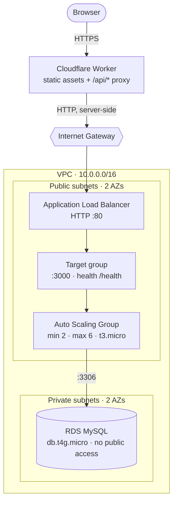

# AWS setup — runbook

Zero to deployed, in order. Roughly **40 minutes** of console work, most of it while RDS
provisions in the background.

Everything here is done **once**. After that the application ships itself: see
[DEPLOYMENT.md](DEPLOYMENT.md). For *why* the architecture is shaped this way, see
[ARCHITECTURE.md](ARCHITECTURE.md).

Region used throughout: **`ap-south-1`**. If you change it, change `AWS_REGION` in
`.github/workflows/deploy.yml` to match.

## Target state



## Three strings that must match

Most failures in this runbook are a mismatch between the console and the repo. Check these
before you start and again at the end.

| Value | Set in the console | Referenced in the repo |
|---|---|---|
| `campuswall-asg` | Auto Scaling Group name | `ASG_NAME` in `.github/workflows/deploy.yml` |
| `ap-south-1` | Region you build in | `AWS_REGION` in the same file |
| ALB DNS name | Output of step 7 | `ALB_HOST` in `apps/web/wrangler.toml` |

---

# Part 1 — Before AWS

## Step 1. Publish the repository

Instances clone the repo at boot, with no credentials, so it **must be public**.

1. Push this repository to GitHub.
2. **Settings → General → Danger Zone → Change visibility → Public.**
3. Confirm `pnpm-lock.yaml` is committed — CI and the EC2 bootstrap both use
   `--frozen-lockfile` and fail without it.

Then set your repo URL in `infra/user-data.sh` and commit it:

```bash
REPO="https://github.com/<YOUR_GITHUB_USER>/hybrid-deploy-arch-demo"
```

> ⚠️ **That is the only placeholder in that file you may commit.** `<RDS_ENDPOINT>` and
> `<RDS_PASSWORD>` are filled in **inside the Launch Template's user-data box** in step 8,
> never in the repository. The repo is public.

## Step 2. Cloudflare credentials

1. **dash.cloudflare.com → Manage Account → Account API Tokens → Create Token.**
2. Use the **Edit Cloudflare Workers** template. Create it and copy the token once — it is
   never shown again.
3. Copy your **Account ID** from the right-hand sidebar of the dashboard home.

---

# Part 2 — IAM

Do this before building anything. The instance role is a dropdown in step 8, and a missing
one causes a silent failure much later.

## Step 3. EC2 instance role

**IAM → Roles → Create role → AWS service → EC2 → Next.**

1. Attach **`AmazonSSMManagedInstanceCore`**.
2. Name it **`campuswall-ec2-role`**. Create.

The SSM Agent ships with Amazon Linux 2023, so nothing else is needed. This role gives you:

- **SSM Run Command** — how deployments reach the fleet
- **Session Manager** — a browser shell into any instance, no key pair, no port 22
- Optionally SSM Parameter Store, to get the database password out of user-data later

Without it, instances launch and run fine but **deployments report success and change
nothing.**

## Step 4. GitHub OIDC provider

So Actions can assume a role without any stored AWS keys.

**IAM → Identity providers → Add provider → OpenID Connect.**

- Provider URL: `https://token.actions.githubusercontent.com`
- Audience: `sts.amazonaws.com`

## Step 5. Deploy role

**IAM → Roles → Create role → Custom trust policy.** Paste, substituting your account ID,
GitHub username and repo name:

```json
{
  "Version": "2012-10-17",
  "Statement": [{
    "Effect": "Allow",
    "Principal": { "Federated": "arn:aws:iam::<ACCOUNT_ID>:oidc-provider/token.actions.githubusercontent.com" },
    "Action": "sts:AssumeRoleWithWebIdentity",
    "Condition": {
      "StringEquals": { "token.actions.githubusercontent.com:aud": "sts.amazonaws.com" },
      "StringLike":   { "token.actions.githubusercontent.com:sub": "repo:<YOUR_GITHUB_USER>/hybrid-deploy-arch-demo:ref:refs/heads/main" }
    }
  }]
}
```

> ⚠️ **The `sub` condition is the line that matters.** Without it, *any* GitHub repository
> in the world can assume this role.

Attach an inline policy:

```json
{
  "Version": "2012-10-17",
  "Statement": [{
    "Effect": "Allow",
    "Action": ["ssm:SendCommand", "ssm:ListCommandInvocations", "ssm:GetCommandInvocation"],
    "Resource": "*"
  }]
}
```

Name the role **`campuswall-gha-deploy`** and copy its ARN.

## Step 6. GitHub secrets

**Repo → Settings → Secrets and variables → Actions → New repository secret.**

| Secret | Value |
|---|---|
| `AWS_DEPLOY_ROLE_ARN` | `arn:aws:iam::<ACCOUNT_ID>:role/campuswall-gha-deploy` |
| `CLOUDFLARE_API_TOKEN` | From step 2 |
| `CLOUDFLARE_ACCOUNT_ID` | From step 2 |

---

# Part 3 — Network

## Step 7. VPC

**VPC → Create VPC → "VPC and more"** (the wizard — it builds subnets, route tables and the
internet gateway in one go).

| Setting | Value |
|---|---|
| Name tag auto-generation | `campuswall` |
| IPv4 CIDR | `10.0.0.0/16` |
| IPv6 | No |
| Availability Zones | **2** |
| Public subnets | **2** |
| Private subnets | **2** |
| **NAT gateways** | **None** |
| VPC endpoints | None |
| DNS hostnames / resolution | **Both enabled** |

NAT gateways cost ~$32/month and add several minutes. The app tier lives in the public
subnets instead — a deliberate trade-off explained in
[ARCHITECTURE.md](ARCHITECTURE.md#why-the-app-tier-is-in-public-subnets).

Take a moment on the **resource map** the wizard draws. It shows the subnets, both route
tables and the internet gateway, and it is the clearest picture AWS gives you for free.

## Step 8. Security groups

**EC2 → Security Groups → Create security group.** Create all three in this order, in the
`campuswall-vpc`. Each one's rule points at **the group before it**, never a CIDR.


| # | Name | Inbound rule | Source |
|---|---|---|---|
| 1 | `alb-sg` | HTTP `80` | `0.0.0.0/0` |
| 2 | `ec2-sg` | Custom TCP `3000` | **`alb-sg`** |
| 3 | `rds-sg` | MySQL/Aurora `3306` | **`ec2-sg`** |

Leave outbound as the default (all traffic). Add `443` to `alb-sg` only if you later attach
an ACM certificate; this setup uses plain HTTP because the Worker calls the ALB server-side.

**There is no port 22 anywhere.** Shell access is Session Manager.

---

# Part 4 — Database

Start this now. It takes ~8 minutes, and you will build the load balancer while it works.

## Step 9. DB subnet group

**RDS → Subnet groups → Create DB subnet group.**

- Name: `campuswall-db-subnets`
- VPC: `campuswall-vpc`
- Availability Zones: both
- Subnets: **the two private subnets only** (`10.0.x.0/24` — check the IDs against the VPC
  resource map; picking public ones here would let you make the database internet-facing)

## Step 10. Create the database

**RDS → Databases → Create database → Standard create.**

| Setting | Value |
|---|---|
| Engine | MySQL **8.4** (matches `docker-compose.yml`) |
| Template | Free tier (or Dev/Test) |
| DB instance identifier | `campuswall-db` |
| Master username | `admin` |
| Master password | Generate one and save it — you need it in step 12 |
| Instance class | `db.t4g.micro` |
| Storage | 20 GiB gp3, **storage autoscaling off** |
| Connect to an EC2 compute resource | **Don't connect** |
| VPC | `campuswall-vpc` |
| DB subnet group | `campuswall-db-subnets` |
| **Public access** | **No** |
| VPC security group | `rds-sg` (remove `default`) |
| Automated backups | Disable (demo only) |
| Enhanced monitoring / Performance Insights | Disable |

Then expand **Additional configuration** and set:

> ⚠️ **Initial database name: `campuswall`**
>
> This is the single most commonly missed field in this runbook. The application connects to
> a database called `campuswall` and creates its *tables* on boot — but it does not create
> the *database*. Leave this blank and every instance will sit at `/health` → `503 degraded`
> forever, with no obvious cause.

Create, and move straight on to the next step while it provisions.

---

# Part 5 — Load balancer

## Step 11. Target group

**EC2 → Target Groups → Create target group → Instances.**

| Setting | Value |
|---|---|
| Name | `campuswall-tg` |
| Protocol / port | HTTP **3000** |
| VPC | `campuswall-vpc` |
| Protocol version | HTTP1 |
| Health check protocol / path | HTTP **`/health`** |

Open **Advanced health check settings** — the defaults are both too slow to watch and too
twitchy under load:

| Setting | Value | Why |
|---|---|---|
| Healthy threshold | **2** | ~20s to join the pool |
| Unhealthy threshold | **5** | ~50s of failures — one slow response can't evict |
| Timeout | **5s** | Survives a loaded event loop |
| Interval | **10s** | Fast enough to watch state change |
| Success codes | `200` | |

Do **not** register any targets — the ASG does that. Create it, then open the group's
**Attributes** tab and set **Deregistration delay to 30 seconds** (the default 300 makes
draining tediously slow to demonstrate). Leave **stickiness off**; turning it on pins each
client to one instance and hides load balancing entirely.

## Step 12. Application Load Balancer

**EC2 → Load Balancers → Create → Application Load Balancer.**

| Setting | Value |
|---|---|
| Name | `campuswall-alb` |
| Scheme | **Internet-facing** |
| IP address type | IPv4 |
| VPC | `campuswall-vpc` |
| Mappings | Both AZs, selecting the **public** subnet in each |
| Security group | `alb-sg` (remove `default`) |
| Listener | **HTTP : 80** → forward to `campuswall-tg` |

**Copy the DNS name** from the load balancer's detail page —
`campuswall-alb-123456789.ap-south-1.elb.amazonaws.com`. You need it in step 16.

---

# Part 6 — Compute

By now RDS should be **Available**. Open it and copy the **endpoint**.

## Step 13. Launch template

**EC2 → Launch Templates → Create launch template.**

| Setting | Value |
|---|---|
| Name | `campuswall-lt` |
| AMI | **Amazon Linux 2023**, x86_64 |
| Instance type | `t3.micro` |
| Key pair | **Do not include** (Session Manager instead) |
| Subnet | **Don't include in template** (the ASG picks) |
| Security group | `ec2-sg` |

Then expand **Advanced details**:

| Setting | Value | Why |
|---|---|---|
| IAM instance profile | **`campuswall-ec2-role`** | Without it, deploys silently do nothing |
| Detailed CloudWatch monitoring | **Enable** | 1-minute metrics; the scaling alarm needs them |
| Credit specification | **Unlimited** | See below |
| Metadata version | **V2 only** | The app uses IMDSv2 |

**Credit specification matters.** `t3` is burstable: sustained CPU spends credits, and when
they run out the instance is throttled to **10% of a vCPU** — the app crawls and does not
recover. Under `unlimited` you pay a few cents for surplus credits instead.

Finally, **User data**: paste the contents of `infra/user-data.sh` and edit the two
placeholders **here, in the console**:

```bash
DB_HOST=<RDS_ENDPOINT>       # the endpoint you just copied, no port
DB_PASS=<RDS_PASSWORD>       # the master password from step 10
```

> ⚠️ **Do not commit those two values.** The repository is public. The `REPO=` line should
> already be correct from step 1.

## Step 14. Auto Scaling Group

**EC2 → Auto Scaling Groups → Create Auto Scaling group.**

| Setting | Value |
|---|---|
| Name | **`campuswall-asg`** — must match `ASG_NAME` in the workflow |
| Launch template | `campuswall-lt` |
| VPC / subnets | `campuswall-vpc`, both **public** subnets |
| Load balancing | Attach to an existing load balancer → `campuswall-tg` |
| **Health check type** | **EC2 only** — leave ELB health checks **off** |
| Health check grace period | `300` seconds |
| Desired / Min / Max | **2 / 2 / 6** |
| Scaling policies | None (added next) |

**Health check type `EC2`, not `ELB`,** while you are experimenting. With `ELB`, a target
that flaps unhealthy under load gets *terminated* by the ASG; with `EC2` the ALB simply
stops routing to it and it recovers on its own. `ELB` is the right production choice once
the workload is stable.

Within ~3 minutes the target group should show two **healthy** targets. If not, jump to
[Troubleshooting](#troubleshooting).

## Step 15. Scaling policy

Two pieces: an alarm, then a policy that reacts to it.

**CloudWatch → Alarms → Create alarm → Select metric → EC2 → By Auto Scaling Group →
`campuswall-asg` → `CPUUtilization`.**

| Setting | Value |
|---|---|
| Statistic | Average |
| Period | **1 minute** |
| Threshold type | Static, **Greater than 40** |
| Datapoints to alarm | **1 of 1** |
| Missing data | Treat as missing |
| Notification | Remove it (no SNS needed) |
| Name | `campuswall-cpu-high` |

**Use step scaling, not target tracking.** Target tracking builds its own alarm requiring
three consecutive datapoints — roughly three minutes before it even fires.

Then **EC2 → Auto Scaling Groups → `campuswall-asg` → Automatic scaling → Create dynamic
scaling policy**:

| Setting | Value |
|---|---|
| Policy type | **Step scaling** |
| Name | `campuswall-scale-out` |
| CloudWatch alarm | `campuswall-cpu-high` |
| Action | **Add `2` capacity units** when `40 <= CPUUtilization < +infinity` |
| Instance warmup | `60` seconds |

Optionally add a scale-**in** policy on a second alarm (`CPUUtilization < 15` for 3
datapoints, remove 1 instance). Scale-in is deliberately slower than scale-out.

---

# Part 7 — Deploy

## Step 16. Point the Worker at the ALB

Edit `apps/web/wrangler.toml` — host name only, no `http://`, no trailing slash:

```toml
[vars]
ALB_HOST    = "campuswall-alb-123456789.ap-south-1.elb.amazonaws.com"
SHOW_STRESS = "false"
```

Commit and **push to `main`**. That is the deploy. Watch the **Actions** tab: `deploy-web`
takes ~30s, `deploy-api` ~90s.

There is nothing to run locally — no `wrangler`, no `aws`, no `ssh`. Configuration lives in
the repo, so changing it is a commit. See [DEPLOYMENT.md](DEPLOYMENT.md).

## Step 17. Verify

Against the ALB directly:

```bash
curl -s http://<alb-dns>/health | jq
# → {"status":"ok","db":true,"served_by":"i-0…","az":"ap-south-1a","uptime_s":…}

for i in $(seq 1 20); do curl -s http://<alb-dns>/api/whoami | jq -r .served_by; done
# → two instance ids, alternating
```

`"db": true` confirms the security group chain and the initial database name are right.

Then open your `*.workers.dev` URL: the client view at `/` and the display view at `/wall`.

## Step 18. Reveal the load generator

Set `SHOW_STRESS = "true"` in `wrangler.toml`, commit, push. About 40 seconds later the
button appears for everyone. This is also how you turn it off afterwards.

**Leave it `"false"` except when you are actively demonstrating.** `/api/stress` is an
unauthenticated endpoint that burns CPU on request.

---

# Exercising the setup

## Watching it scale

Normal traffic will not move CPU on a `t3.micro` — a few small inserts and an indexed select
is single-digit percent. `/api/stress` exists to create real load.

```
Capacity:  2 instances × 2 vCPU  = 4 vCPU-seconds per second
Load:      N requests/sec × B seconds of burn
```

| Goal | Required |
|---|---|
| Hold CPU above the 40% threshold | `N × B ≥ 1.6` |
| Peg CPU at ~100% | `N × B ≥ 4.0` |

At `BURN_MS=500`, about **3.2 requests/second** clears the threshold and **8/second**
saturates. Overshooting is harmless — CPU pegs and the queue grows, which is the condition
scaling exists for. Undershooting means the alarm never fires.

Generate it deterministically:

```bash
npx autocannon -c 8 -d 180 -m POST "http://<alb-dns>/api/stress?ms=500"
```

Expect **3–5 minutes** end to end:

| Phase | Duration |
|---|---|
| Metric publish + alarm evaluation | 60–120s |
| EC2 launch to `running` | 30–45s |
| user-data: install, clone, build | 60–90s |
| Health check passes (10s × 2) | ~20s |

To make it faster, bake a **custom AMI** with Node and dependencies pre-installed (cuts
user-data to ~15s, total to ~2 minutes), or use an **ASG warm pool** (~30 seconds).

## What to watch

Build a CloudWatch dashboard with four widgets: `CPUUtilization`, `TargetResponseTime`,
`RequestCount`, `HealthyHostCount`. `TargetResponseTime` rising and then recovering as new
instances join is the clearest single picture of autoscaling working.

Also keep **Target groups → `campuswall-tg` → Targets** open: `initial` → `healthy` →
`draining` → gone, live.

**ALB access logs require an S3 bucket** and are deliberately not used here. CloudWatch
metrics cover everything needed.

## Failure behaviour worth trying

| Action | Expected |
|---|---|
| Terminate an instance (EC2 console) | ALB drains it, ASG launches a replacement, no downtime |
| Delete the `0.0.0.0/0 → igw` route from the public route table | Everything stops. Restore it and it returns |
| `mysql -h <rds-endpoint>` from your laptop | Hangs — it is in a private subnet |
| Same command from a Session Manager shell | Connects immediately |

---

# Troubleshooting

| Symptom | Cause |
|---|---|
| Targets stuck `unhealthy` | Session Manager in, then `cat /var/log/user-data.log`, `systemctl status campuswall`, `journalctl -u campuswall -n 50` |
| `/health` returns `degraded`, `"db": false` | **Initial database name not set** (step 10), or `rds-sg` isn't allowing `ec2-sg`, or `DB_HOST`/`DB_PASS` wrong in user-data |
| `Connect` button greyed out in EC2 console | Instance profile missing from the launch template — instances already running need replacing |
| Deploy is green but nothing changed | ASG name ≠ `ASG_NAME`, or no instance profile. SSM matched zero targets and still succeeded |
| `deploy-api` fails at `configure-aws-credentials` | OIDC `sub` condition doesn't match your repo or branch |
| Worker returns `502 origin unreachable` | `ALB_HOST` wrong, has a scheme or trailing slash, or `alb-sg` isn't open on 80 |
| Everything slows down after a few minutes of load | `t3` credits exhausted — credit specification must be `unlimited` |
| Instances cycle endlessly under load | Health check timeout too low, or ASG health check type set to `ELB` |
| Only one instance ever answers | Target group stickiness is on |

**Session Manager:** EC2 → Instances → select → **Connect** → *Session Manager* tab. No key
pair, no port 22, no bastion.

---

# Teardown

Delete in this order or dependencies block you:

1. **Auto Scaling Group** — set desired/min to `0`, wait for instances to terminate, delete
2. **Load balancer**, then the **target group**
3. **RDS instance** — skip the final snapshot for a throwaway stack
4. **Launch template**
5. **CloudWatch alarms**
6. **VPC** — removes subnets, route tables and the internet gateway
7. Optionally the IAM roles and the OIDC provider

## Cost

| Resource | Rate |
|---|---|
| ALB | ~$0.0225/hr + LCU |
| 2–6 × t3.micro | ~$0.0104/hr each |
| RDS db.t4g.micro | ~$0.016/hr |
| NAT Gateway | **$0 — avoided** |
| Cloudflare Workers | Free tier |

About **$0.06/hour** running, so well under **$0.20** for a two-hour session. Left up
continuously it is **~$45/month**, dominated by the ALB and RDS. **Set a reminder to tear it
down**, and check the Billing dashboard afterwards.
