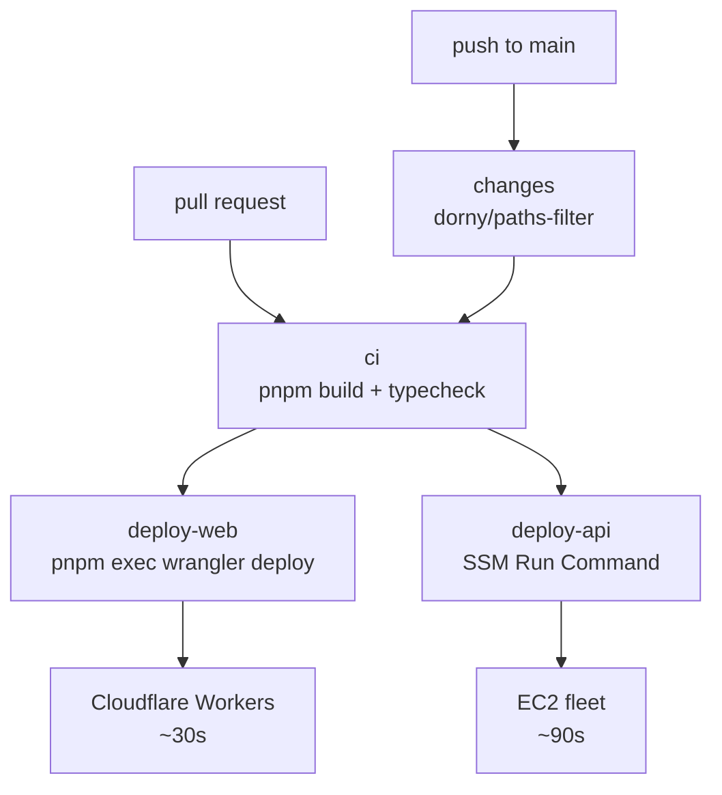
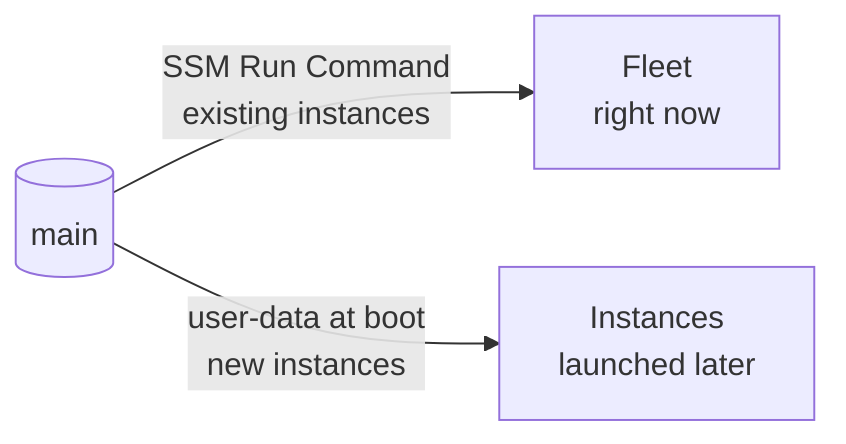

# Deployment

**Deployment is a push to `main`.** No `wrangler`, `aws`, `ssh` or `scp` from a local
machine, ever. Local commands are for developing; `main` is for shipping.

## Pipeline



The `changes` job decides which half runs. `packages/shared/**` counts as **both**, because
a change there affects the API and the client equally.

| | Worker | EC2 fleet |
|---|---|---|
| Mechanism | `wrangler deploy` in CI | SSM Run Command |
| Duration | ~30s | ~90s |
| Atomicity | Atomic, global | Rolling, eventually consistent |
| Auth | Stored API token | **OIDC — nothing stored** |
| Rollback | Revert the commit | Revert the commit |
| New machines | N/A | Pick up code from user-data at boot |

That asymmetry is inherent. One half is a file upload to an edge network; the other is a
fan-out across a fleet whose membership changes while you are deploying to it.

## Why SSM Run Command

You cannot deploy *to* an Auto Scaling Group — the set of machines changes underneath you.

| Approach | Verdict |
|---|---|
| SSH + `git pull` | Needs port 22 open to GitHub's runner IP ranges and a private key in secrets. Rejected. |
| **SSM Run Command** | ✅ No inbound ports, no keys. Targets instances **by ASG tag**, so it always hits the current fleet. |
| Golden AMI + instance refresh | The most correct answer, and 8–15 minutes per deploy. |
| CodeDeploy | The AWS-native option; supports GitHub as a source. Another service to operate. |

## One-time setup

All of it lives in the runbook so there is one authoritative sequence:
**[AWS_SETUP.md](AWS_SETUP.md) steps 3–6.**

| Step | What | Why it matters here |
|---|---|---|
| 3 | IAM role `campuswall-ec2-role` on the launch template | Without it SSM matches zero instances and the deploy **reports success while changing nothing** |
| 4 | GitHub OIDC identity provider | Lets Actions assume a role with no stored AWS keys |
| 5 | Role `campuswall-gha-deploy`, `sub` scoped to your repo **and branch** | An unscoped `sub` lets *any* GitHub repo assume your role |
| 6 | Secrets: `AWS_DEPLOY_ROLE_ARN`, `CLOUDFLARE_API_TOKEN`, `CLOUDFLARE_ACCOUNT_ID` | |

Cloudflare has no OIDC equivalent for Wrangler, so its token is a stored secret — the one
long-lived credential in the system.

Also confirm `ASG_NAME` in `.github/workflows/deploy.yml` equals the Auto Scaling Group
name. A mismatch means the deploy targets zero instances **and still passes.**

## Configuration is a commit

Everything environment-specific lives in a tracked file, so there is never a reason to run a
local command:

```toml
# apps/web/wrangler.toml
[vars]
ALB_HOST    = "campuswall-alb-123456789.ap-south-1.elb.amazonaws.com"
SHOW_STRESS = "false"
```

Edit, push to `main`, live in ~40 seconds. This can be done entirely from the GitHub web UI.

## Redeploying without a commit

**Actions → deploy → Run workflow.** The `workflow_dispatch` trigger takes a `force` input
that deploys both halves regardless of what changed. Still no local commands.

## Rollback

**Commits → ⋯ → Revert** on GitHub. Worker back in ~40s, fleet in ~90s.

## Two deployment paths, one branch



SSM only updates instances that exist **at that moment**. An instance launched afterwards —
by a scale-out event, say — gets its code from `user-data.sh`, which clones `main`. Both
paths pull the same branch, so they agree.

There is a genuine race: an instance launching *during* a deploy can land on either version.
Harmless for a stateless API with a compatible schema; in production this is precisely why
**golden AMIs and instance refresh** exist, so that the artifact is fixed before any
instance boots.

## What CI catches

`pnpm -r typecheck` runs on every pull request. Because `packages/shared` is imported by
both applications, breaking the `Post` type fails the build **before** either deploy job
runs. That is the monorepo doing useful work rather than just being a folder layout.
