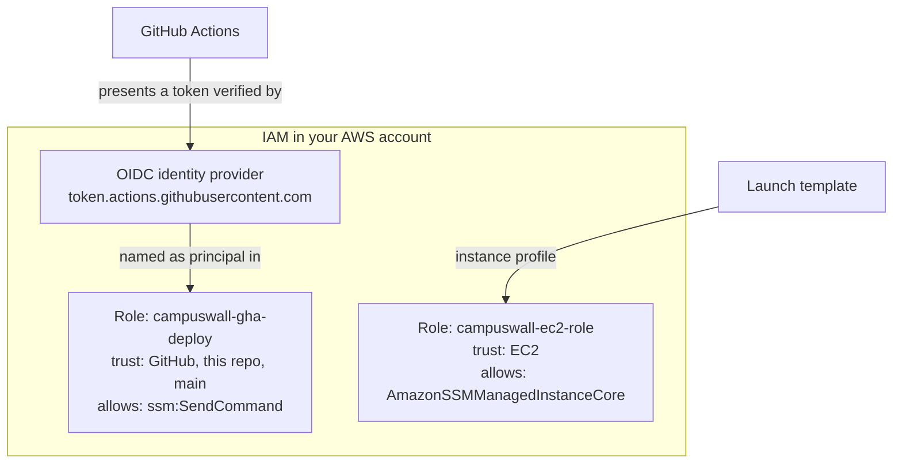
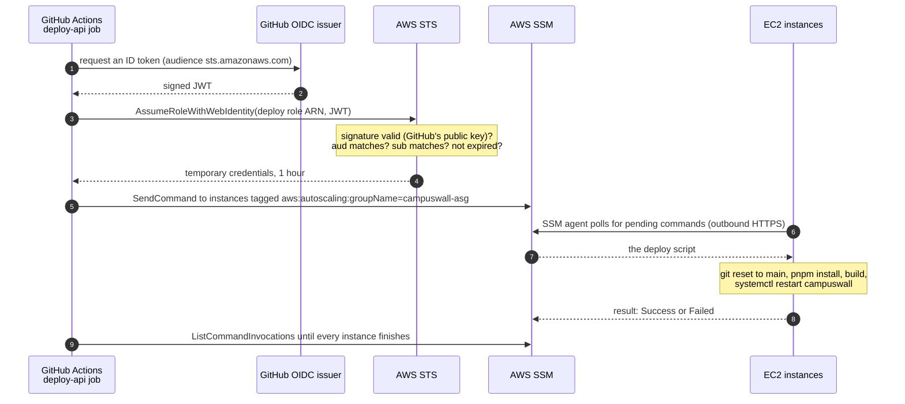
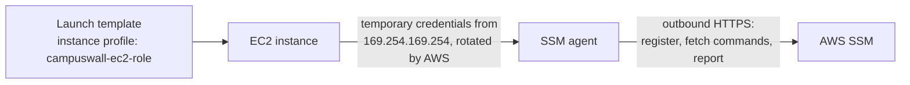

# IAM and OIDC

How GitHub Actions deploys to the EC2 fleet without a single stored AWS key, and how the
instances receive the deployment. This document explains *what* each piece is and *why* it
exists. The console clicks are in [AWS_SETUP.md](AWS_SETUP.md) steps 3–6.

## Part 1 — The building blocks

### Every AWS action is an API call

Clicking a button in the console, running `aws ssm send-command`, or an SSM agent asking
for work all end up as an HTTPS request to an AWS API. AWS accepts a request only if:

1. it is **signed** with valid AWS credentials, and
2. the identity those credentials belong to is **allowed** to perform that action.

Everything in this document is about those two checks.

### Credentials

AWS credentials are a set of values used to sign requests.

| Kind | Made of | Expires |
|---|---|---|
| **Long-term** (an IAM user's access key) | Access key ID + secret access key | Never, until someone deletes it |
| **Temporary** (issued by STS) | Access key ID + secret access key + **session token** | Automatically, 15 minutes to 12 hours (1 hour here) |

A leaked long-term key works for whoever holds it until it is noticed and revoked. A leaked
temporary key stops working on its own. **This repository uses only temporary credentials.**

### IAM

**IAM (Identity and Access Management)** is the AWS service that stores *who* exists in an
account and *what* each of them is allowed to do. It holds users, roles, policies and
identity providers. IAM is global: it is not tied to a region.

### Principal

A **principal** is whoever makes a request: an IAM user, an IAM role, an AWS service (for
example `ec2.amazonaws.com`), or an identity from outside AWS that IAM has been told to
trust (a **federated** identity, such as a GitHub workflow run).

### ARN

An **ARN (Amazon Resource Name)** is the unique ID of any AWS resource, including IAM ones:

```
arn:aws:iam::123456789012:role/campuswall-gha-deploy
            └─account id─┘ └type┘ └────name─────┘
```

Policies refer to principals and resources by ARN.

### Policy

A **policy** is a JSON document that allows or denies actions. Every statement in it has
the same parts:

```jsonc
{
  "Version": "2012-10-17",
  "Statement": [{
    "Effect":    "Allow",                         // Allow or Deny
    "Action":    ["ssm:SendCommand"],             // which API calls
    "Resource":  "*",                             // on which resources (ARNs)
    "Condition": { "...": "..." }                 // optional: only when these are true
  }]
}
```

How AWS decides:

- **Default deny.** If no policy allows an action, it is denied.
- **Explicit allow.** A matching `Allow` statement permits it.
- **Explicit deny wins.** A matching `Deny` overrides any `Allow`.

### Role

A **role** is an IAM identity that **has no password and no long-term keys**. Nobody logs in
as a role. Instead, a principal **assumes** it and receives temporary credentials that carry
the role's permissions.

Every role has two kinds of policy attached:

| Policy | Answers | Example in this repo |
|---|---|---|
| **Trust policy** | **Who** may assume this role, and under what conditions | "EC2 instances", or "a GitHub run from this exact repo on `main`" |
| **Permissions policy** | **What** the role may do once assumed | "send SSM commands" |

Both must agree. Being allowed to assume a role grants nothing beyond the role's
permissions, and a role's permissions are unreachable to anyone the trust policy doesn't
name.

### STS

**STS (Security Token Service)** is the AWS service that issues temporary credentials. When
a principal assumes a role, it is calling STS. STS checks the role's trust policy, and if it
matches, returns an access key ID, secret access key and session token that expire.

| STS call | Used by |
|---|---|
| `AssumeRole` | AWS principals assuming a role (used behind the scenes for EC2) |
| `AssumeRoleWithWebIdentity` | Outside identities that present a signed token, such as GitHub |

### Instance profile

An **instance profile** is the container that attaches a role to an EC2 instance. On the
instance, AWS assumes the role automatically and serves the resulting temporary credentials
at the instance metadata address `169.254.169.254`, rotating them before they expire. Any
AWS SDK or agent on the machine picks them up without configuration. The console creates the
instance profile for you, with the same name as the role.

### OIDC and JWT

**OIDC (OpenID Connect)** is an open standard for one system to prove an identity to
another using a signed token.

That token is a **JWT (JSON Web Token)**: three base64 sections joined by dots.

```
header . claims . signature
```

- **Claims** are JSON fields describing the identity (who issued it, who it's for, and who it
  is about).
- The **signature** is computed with the issuer's private key. Anyone with the issuer's
  public key can verify that the claims were written by the issuer and not changed since.

### OIDC identity provider (in IAM)

An **OIDC identity provider** is an IAM entry that names an external token issuer, such as
`https://token.actions.githubusercontent.com`. Creating it makes AWS fetch that issuer's
public keys, so STS can verify tokens it signs. It grants no permissions on its own; it only
allows the issuer's tokens to be used as `Principal` in a trust policy.

## Part 2 — What this repository creates



| Step in AWS_SETUP | Resource | Trust policy | Permissions policy |
|---|---|---|---|
| 3 | `campuswall-ec2-role` | The EC2 service (`ec2.amazonaws.com`) | `AmazonSSMManagedInstanceCore`: register with SSM, receive commands, report results |
| 4 | OIDC identity provider | — | — |
| 5 | `campuswall-gha-deploy` | Tokens from GitHub whose `sub` is this repo on `main` | `ssm:SendCommand`, `ssm:ListCommandInvocations`, `ssm:GetCommandInvocation` |

### The deploy role's trust policy

```json
{
  "Effect": "Allow",
  "Principal": { "Federated": "arn:aws:iam::<ACCOUNT_ID>:oidc-provider/token.actions.githubusercontent.com" },
  "Action": "sts:AssumeRoleWithWebIdentity",
  "Condition": {
    "StringEquals": {
      "token.actions.githubusercontent.com:aud": "sts.amazonaws.com",
      "token.actions.githubusercontent.com:sub": "repo:OWNER@111/hybrid-deploy-arch-demo@222:ref:refs/heads/main"
    }
  }
}
```

| Line | Meaning |
|---|---|
| `Principal.Federated` | Only tokens issued by GitHub, and verified through the OIDC identity provider, are considered |
| `Action: sts:AssumeRoleWithWebIdentity` | The permitted operation: exchange a token for this role's temporary credentials |
| `aud = sts.amazonaws.com` | The token must have been issued **for AWS STS**, not for another service |
| `sub = repo:OWNER@111/…@222:ref:refs/heads/main` | The token must come from **exactly this repository** on **`main`** |

`111` and `222` stand for the owner's and repository's permanent numeric IDs. Copy the real
prefix from **Settings → Actions → OIDC → Default subject claim prefix**. Because IDs are
never reused, `StringEquals` on the full value matches this one repository and no other,
including one that later takes the same name. Without a `sub` condition, any repository on
GitHub could assume the role.

### GitHub's token

Decoded, the claims of the token a deploy run receives look like this:

```json
{
  "iss": "https://token.actions.githubusercontent.com",
  "aud": "sts.amazonaws.com",
  "sub": "repo:OWNER@111/hybrid-deploy-arch-demo@222:ref:refs/heads/main",
  "repository": "OWNER/hybrid-deploy-arch-demo",
  "ref": "refs/heads/main",
  "exp": 1760000000
}
```

| Claim | Meaning |
|---|---|
| `iss` (issuer) | Who signed it; must match the OIDC identity provider |
| `aud` (audience) | Who it was issued for; checked by the trust policy |
| `sub` (subject) | Which repo and ref the run belongs to; checked by the trust policy |
| `exp` (expiry) | The token is valid for only a few minutes |

## Part 3 — A deployment, end to end



Where each step lives in [`.github/workflows/deploy.yml`](../.github/workflows/deploy.yml):

| Steps | Workflow |
|---|---|
| 1–2 | `permissions: id-token: write` lets the job request an ID token. Without it, no token is issued |
| 3–4 | `aws-actions/configure-aws-credentials` with `role-to-assume: ${{ secrets.AWS_DEPLOY_ROLE_ARN }}` calls STS and exports the temporary credentials as environment variables |
| 5 | `aws ssm send-command`, signed with those credentials |
| 9 | The `list-command-invocations` loop |

The only AWS value stored in GitHub is the role's **ARN**. An ARN identifies a role; it is not
a credential and grants nothing without a token that satisfies the trust policy.

### On the instance



- The SSM agent is preinstalled on Amazon Linux 2023. It signs its requests with the
  instance profile's credentials.
- The agent **pulls** commands over an outbound connection, so the instance needs **no
  inbound port**: no SSH, no port 22, no key pair.
- `SendCommand` targets a **tag**, not instance IDs, so it reaches whichever instances the
  Auto Scaling Group is running at that moment.
- Without the instance role, the agent cannot register. `SendCommand` then matches no
  instances and the deploy changes nothing.

## Part 4 — What the trust policy refuses

| Situation | STS outcome | Why |
|---|---|---|
| Workflow on a feature branch, a tag, or a pull request | Refused | `sub` ends in a different ref |
| Another repository uses your role ARN | Refused | `sub` contains different IDs |
| A repository created later with your old repo's name | Refused | Same name, different numeric IDs |
| A token issued for a different audience | Refused | `aud` is not `sts.amazonaws.com` |
| A captured token used later | Refused | Past `exp` |
| Temporary credentials leak | Expire within the hour, and allow only SSM commands | Short lifetime, minimal permissions |

## Cloudflare is the exception

Cloudflare does not accept OIDC tokens for Wrangler, so `CLOUDFLARE_API_TOKEN` is a stored,
long-lived secret, the only one in the system. Scope it to *Edit Cloudflare Workers* and
revoke it when you tear the stack down.
