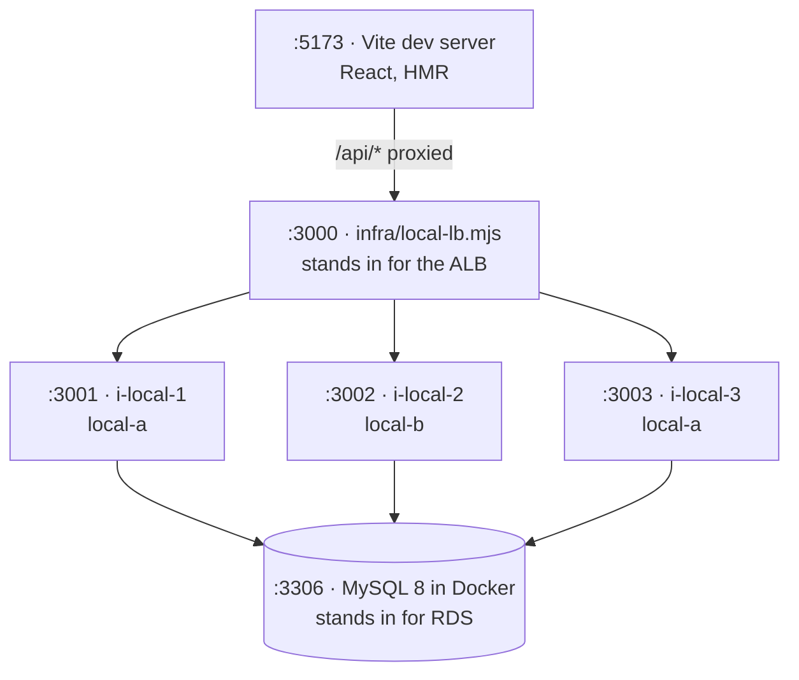

# Local development

The local environment reproduces everything the architecture depends on — multiple
instances, round-robin routing, health checks, instance identity and a real MySQL — so
load-balancer and failover behaviour can be exercised without an AWS account.

## Prerequisites

- Node 22+ (Wrangler requires it)
- pnpm 9+ (`corepack enable pnpm`)
- Docker (MySQL only)

## Start

```bash
pnpm install
pnpm dev
```

- **Client view** — http://localhost:5173
- **Display view** — http://localhost:5173/wall

> Run `pnpm install` once and commit `pnpm-lock.yaml`. CI and the EC2 bootstrap both use
> `--frozen-lockfile`.

## What runs



| Command | Use it for |
|---|---|
| `pnpm dev` | Anything load-balancer-shaped |
| `pnpm dev:solo` | Ordinary feature work — one API, less terminal noise |
| `pnpm dev:edge` | `wrangler dev`, the real Worker. **Before every deploy.** |
| `pnpm db:up` / `pnpm db:down` | MySQL container (`down` also drops the volume) |
| `pnpm build` / `pnpm typecheck` | What CI runs |

## The local load balancer

`infra/local-lb.mjs` is ~30 lines with no dependencies, and copies two behaviours from a
real ALB:

1. **Round-robin per request**, not per connection. An ALB terminates the client connection
   and routes each request independently, which is why request distribution is visible even
   over a single keep-alive connection.
2. **Health checks every 10s**, the same interval configured on the real target group.

| Env var | Default | Purpose |
|---|---|---|
| `TARGETS` | `3001,3002,3003` | Comma-separated upstream ports |
| `LB_PORT` | `3000` | Listen port |
| `HEALTH_PATH` | `/health` | Set to `/api/whoami` to work without Docker |

`HEALTH_PATH` exists because `/health` queries the database. If you are working on the UI
and do not want MySQL running, point health checks at an endpoint that does not touch it.

## Exercising failure

The point of running three instances locally is that you can break things.

```bash
# see round-robin
for i in $(seq 1 12); do curl -s localhost:3000/api/whoami | jq -r .served_by; done
# → i-local-1, i-local-2, i-local-3, i-local-1, ...
```

**Kill an instance.** Find the process for port 3002 and stop it:

```bash
kill $(pgrep -f 'PORT=3002')     # or Ctrl-C its pane in the concurrently output
```

Then watch:

- an immediate `502 bad gateway` for any request already routed to it — the LB ejects it
  on connection error, as a real ALB does
- `[lb] :3002 UNHEALTHY — draining` in the output
- traffic settling onto the remaining two instances
- the badge disappearing from the display view and the activity meter redistributing

> Do not use `kill $(lsof -ti tcp:3002)`. That matches the load balancer too, because it
> holds an outbound connection to that port, and you will kill the LB instead.

**Kill all of them** and the LB returns `503 no healthy targets`, which is what the real ALB
does when a target group has no healthy members.

**Stop MySQL** (`pnpm db:down`) and every instance reports `503 degraded` on `/health` while
staying up. The API does not exit when the database is unavailable — it retries the schema
with backoff and lets the load balancer decide whether to route to it.

## Generating load

```bash
npx autocannon -c 8 -d 60 -m POST "http://localhost:3000/api/stress?ms=500"
```

What this **can** verify locally:

- `burn()` yields properly — `/health` keeps answering under sustained load
- no target drops out of the local LB during a burn
- the activity meter redistributes when an instance disappears
- the badge genuinely alternates between instances

What it **cannot** verify: CPU thresholds. A development machine has far more cores than a
`t3.micro`, so percentages will not transfer. Tune CloudWatch alarm thresholds against real
instances.

A quick check that the event loop is not blocked — probe the same instance mid-burn:

```bash
curl -s -X POST "localhost:3001/api/stress?ms=2000" &
sleep 0.3
curl -s -o /dev/null -w "%{time_total}s\n" localhost:3001/api/whoami
```

Expect single-digit milliseconds. If it approaches 2 seconds, the event loop is blocked and
the ALB would evict this instance in production.

## Instance identity

There is no IMDS on a development machine, so `apps/api/src/identity.ts` reads environment
variables first and only falls back to instance metadata:

```ts
if (process.env.INSTANCE_ID) return { served_by: process.env.INSTANCE_ID, az: process.env.AZ ?? 'local' };
// else IMDSv2: PUT /latest/api/token, then GET /latest/meta-data/instance-id
```

On EC2 these variables are **unset**, which is what triggers the metadata path. IMDSv2
requires fetching a token first — a plain GET returns 401 on Amazon Linux 2023. Identity is
resolved once at startup and cached; never per request.

## Configuration

| Variable | Local | AWS | Set by |
|---|---|---|---|
| `DB_HOST` | `127.0.0.1` | RDS endpoint | user-data |
| `DB_USER` | `root` | `admin` | user-data |
| `DB_PASS` | `local` | RDS password | user-data |
| `DB_NAME` | `campuswall` | `campuswall` | both |
| `PORT` | `3001`–`3003` | `3000` | both |
| `INSTANCE_ID` / `AZ` | `i-local-N` / `local-a` | *unset* → IMDSv2 | local only |
| `STRESS_ENABLED` | `true` | `true` | user-data |
| `BURN_MS` | `wrangler.toml` / `.dev.vars` | `wrangler.toml` | **edge only** — the API never reads it |
| `ALB_HOST` (Worker) | `localhost:3000` | ALB DNS name | `.dev.vars` / `wrangler.toml` |
| `SHOW_STRESS` (Worker) | `true` | commit to change | `.dev.vars` / `wrangler.toml` |

```bash
cp apps/api/.env.example apps/api/.env
cp apps/web/.dev.vars.example apps/web/.dev.vars
```

Both real files are git-ignored.

## Two frontend modes

| Command | Runs | Use for |
|---|---|---|
| `pnpm dev:web` | Vite, `/api` proxied to `:3000` | Everyday UI work — fast HMR |
| `pnpm dev:edge` | `wrangler dev` — the Worker in workerd | Verifying proxy logic and vars |

**Check `dev:edge` before every deploy.** The Vite proxy and the Worker's `fetch()` are
different code paths, and the Worker is the one that ships.

## Monorepo notes

`packages/shared` is consumed two different ways:

- **Vite aliases it to source**, so editing `content.ts` or `types.ts` hot-reloads the UI
- **The API imports the built `dist`**, so it needs `pnpm --filter "@campuswall/api..." build`

The `...` suffix means "this package and its dependencies", which builds `shared` first and
skips React, Vite and Wrangler entirely — roughly 60 seconds saved on every EC2 boot.

Change a type in `packages/shared/src/types.ts` and both applications fail to compile. That
is the monorepo earning its keep; `pnpm typecheck` catches it before CI does.

## No test runner

There is no test suite. Verify changes by running `pnpm dev` and exercising the endpoints —
the failure scenarios above are the meaningful cases.
